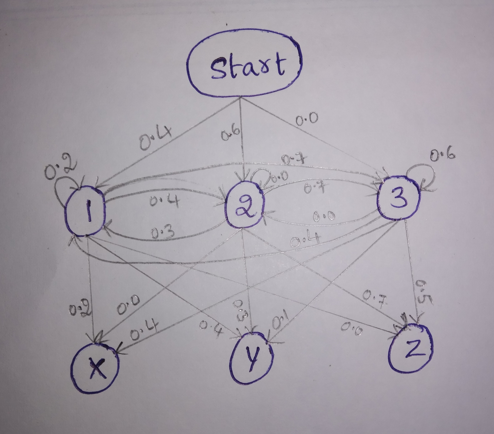

# Hidden Markov Model.

This is a simple implementation of the Viterbi Algorithm for training Hidden Markov model.
In simple terms, a Hidden Markov Model(HMM) is a machine learning method for modelling a sequence as a result of a markovian process that cannot be observed(hidden).

The goal is given the output sequence, we will find the most likely sequence of hidden states which caused that output sequence. 

Consider the following example graph of hidden Markov model for better understanding :

Let's say the output sequence be XXZ.

Run the file 'HMM_Viterbi__Algorithm.ipynb'

So the most probable path is '133' in this case.
